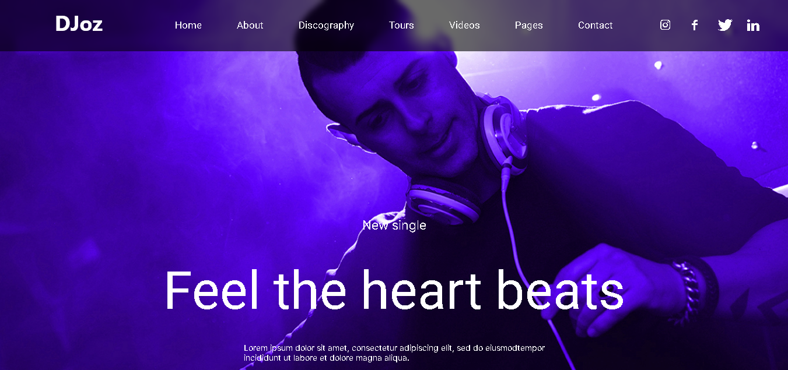
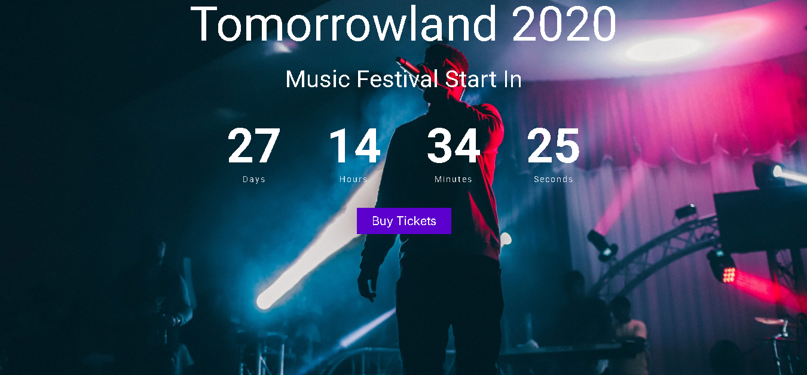

<h1 align="center">🎧 DJ Website Template</h1>

  

  A stylish music & DJ landing page template built with pure HTML & CSS.

---

## 📸 Preview

  
  
  

---

## 📌 Description

This is a simple **static DJ / Music website template** created using **only HTML5 and CSS3**.  
Perfect for showcasing music profiles, events, playlists, and visuals — **no frameworks used**.

---

## 🛠 Built With

- HTML5  
- CSS3

---

## 🚀 Live Demo

Try the live version 👇

  

---

## 📁 Folder Structure

---

## 📌 Notes

⭐ This project is a **pure front‑end template** — no JavaScript or frameworks included.  
🧩 You can use it as a base for your own DJ portfolio or music landing page.

---

  Made with ❤️ by **Arshia**

